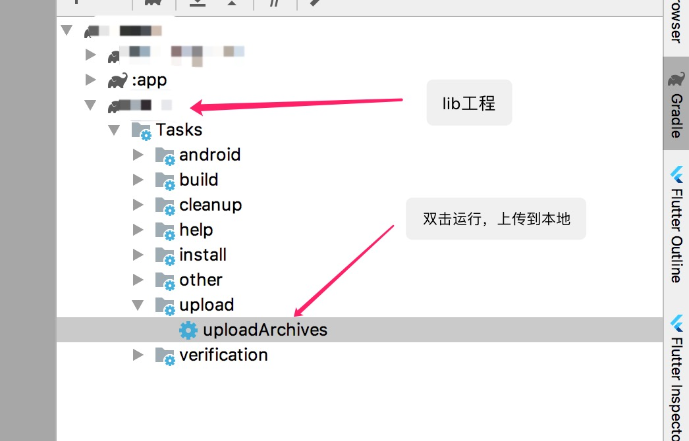

# Maven仓库

#### 一 、Maven私服地址

#### `maven { url "https://raw.githubusercontent.com/Android-Mainli/Maven/master" }`


#### 二 、Maven上传方法

1. 在lib目录中添加`mavenpublish.gradle`，内容如下：

   ```groovy
   apply plugin: 'maven'
   
   uploadArchives {
       repositories.mavenDeployer {
           def deployPath = file("<本地路径>")
           repository(url: "file://${deployPath.absolutePath}")
           pom.project {
               groupId 'com.xxxx'
               artifactId 'xxxx'
               version '1.0.0'
           }
       }
   }
   
   // 源代码一起打包(不需要打包源代码的不要添加这几行)
   task androidSourcesJar(type: Jar) {
       classifier = 'sources'
       from android.sourceSets.main.java.sourceFiles
   }
   artifacts {
       archives androidSourcesJar
   }
   ```

2. 修改上诉文件中`<本地路径>`为一个github项目克隆在本地的路径。

2. 在lib目中的build.gradle中加入

   ```groovy
   apply from: 'mavenpublish.gradle'
   ```

3. 在Android Studio右侧，按图片说明运行`uploadArchives`脚本上传到本地。

4. 在本地github克隆下的目录中，提交上传的更改并push到github远程。

5. 使用aar

   ```groovy
   //在项目根目录中添加maven地址 ， 改改<github用户名>/<github项目名称>
   //本工程修改后示例：maven { url "https://raw.githubusercontent.com/Android-Mainli/Maven/master" }
   allprojects {
       repositories {
           maven { url "https://raw.githubusercontent.com/<github用户名>/<github项目名称>/master" }
       }
   }
   //添加依赖 依次填入脚本中设定的<groupId>:<artifactId>:<version>
   //如本项目下blur示例：implementation 'com.mainli:blur:1.0.0'
   implementation '<groupId>:<artifactId>:<version>'
   ```

   